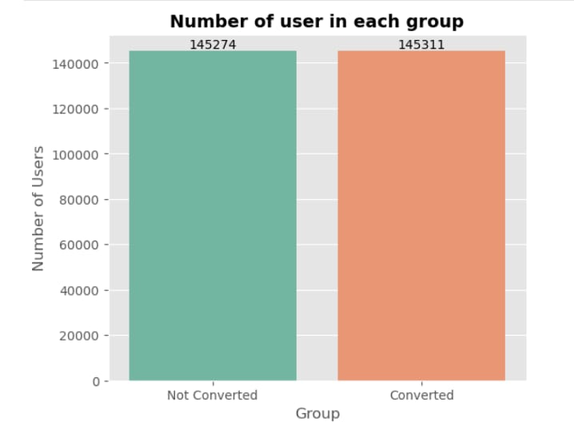
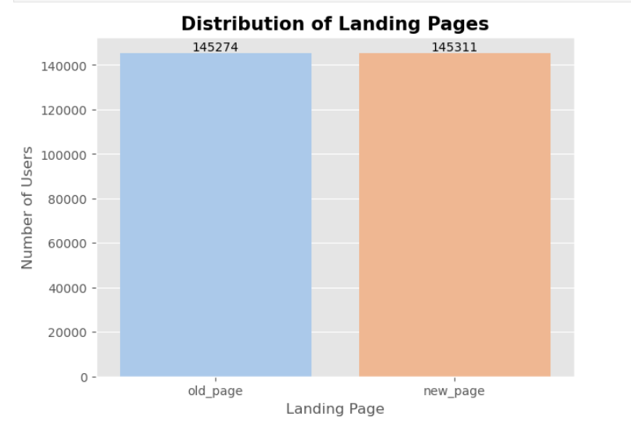
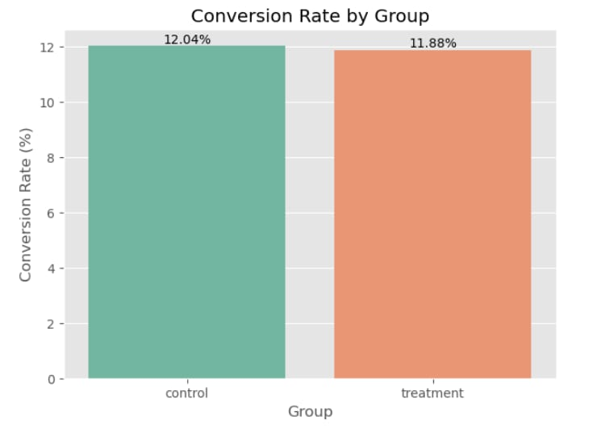
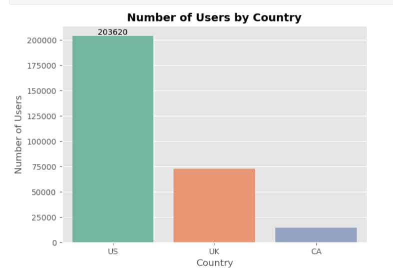
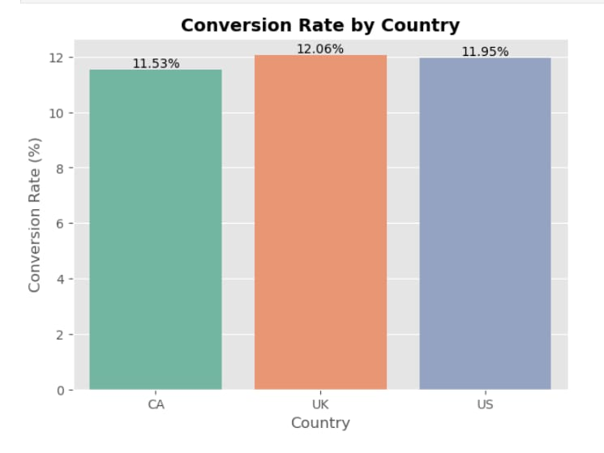
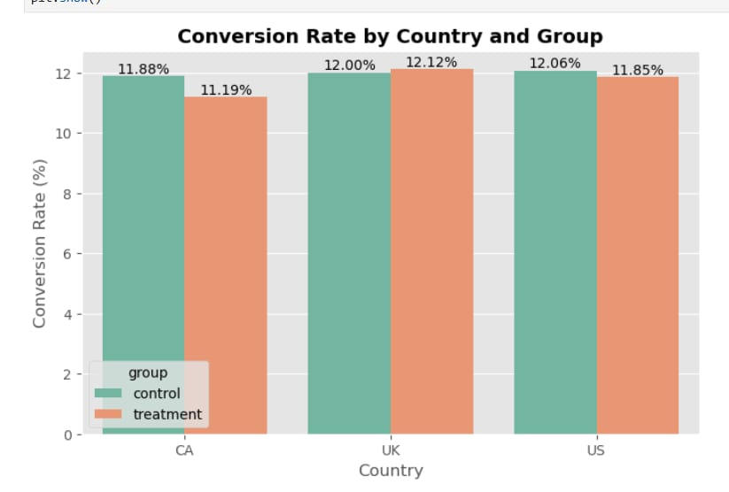

# A/B Testing Analysis of Landing Page Conversion

## Project Overview

This project analyzes an A/B test conducted by an e-commerce company to determine whether a new landing page performs better than the existing landing page.

The company wanted to increase the number of users who complete a desired action, such as signing up or making a purchase. Instead of replacing the old page immediately, they tested both versions by showing different pages to different users.

The goal of this project is to analyze the experiment, compare the conversion rates, perform statistical testing, and provide a business recommendation based on the results.

---

# Business Problem

A company designed a new landing page with the expectation that it would encourage more users to convert.

Before launching the new page for everyone, the company wanted to answer an important business question:

**Does the new landing page actually increase the conversion rate, or is the difference only due to random chance?**

Making the wrong decision could lead to lower conversions and financial losses. Therefore, the company conducted an A/B test to make a data-driven decision.

---

# Business Objective

The main objectives of this project are:

- Understand the A/B testing dataset.
- Clean and prepare the data for analysis.
- Compare the performance of the old and new landing pages.
- Analyze user conversion across different countries.
- Perform statistical hypothesis testing.
- Provide a business recommendation based on the results.

---

# Dataset Information

The project uses two datasets.

### ab_data.csv

This dataset contains user-level information such as:

- User ID
- Group (Control or Treatment)
- Landing Page
- Conversion Status

### countries.csv

This dataset contains the country associated with each user.

After merging both datasets, the final analysis includes:

- User Group
- Landing Page
- Conversion Status
- Country

---

# Tools and Technologies

- Python
- Pandas
- NumPy
- Matplotlib
- Seaborn
- Statsmodels
- Jupyter Notebook

---

# Project Workflow

The project follows the complete data analysis process.

1. Data Collection
2. Data Cleaning
3. Exploratory Data Analysis (EDA)
4. Data Visualization
5. Hypothesis Testing
6. Business Recommendation

---

# Exploratory Data Analysis

Several visualizations were created to better understand the data.

### 1. Number of Users in Each Group

This chart shows how users were divided between the Control and Treatment groups.



---

### 2. Distribution of Landing Pages

This visualization confirms that users were assigned almost equally to both landing pages.



---

### 3. Conversion Rate by Group

This chart compares the conversion rate of the Control and Treatment groups.



---

### 4. Number of Users by Country

This visualization shows the distribution of users across different countries.



---

### 5. Conversion Rate by Country

This chart compares conversion rates across countries.



---

### 6. Conversion Rate by Country and Group

This visualization compares the performance of both landing pages within each country.



---

# Statistical Analysis

A Two-Proportion Z-Test was performed to compare the conversion rates of the Control and Treatment groups.

### Null Hypothesis (H₀)

The new landing page does not improve the conversion rate.

### Alternative Hypothesis (H₁)

The new landing page has a higher conversion rate than the old landing page.

### Results

- Z-Statistic: **1.3116**
- P-Value: **0.0948**
- Significance Level (α): **0.05**

Since the p-value is greater than 0.05, we fail to reject the null hypothesis.

---

# Key Findings

- The Control and Treatment groups contained almost the same number of users.
- The conversion rates of both groups were very close.
- Country-wise differences in conversion rates were small.
- The Treatment group showed a slightly higher conversion rate, but the improvement was not statistically significant.

---

# Business Recommendation

Based on the analysis, the company should continue using the current landing page.

Although the new landing page performed slightly better, the difference was not statistically significant. This means there is not enough evidence to conclude that the new page improves user conversions.

Instead of launching the new page immediately, the company should:

- Continue the experiment for a longer period.
- Collect more user data.
- Test additional landing page designs.
- Analyze user behavior by device type or traffic source.

---

# Conclusion

This project demonstrates how A/B testing can help businesses make informed decisions using data instead of assumptions.

By combining exploratory data analysis with statistical hypothesis testing, the project shows that even when one version appears to perform better, statistical evidence is necessary before making business decisions.

---

# Skills Demonstrated

- Data Cleaning
- Exploratory Data Analysis (EDA)
- Data Visualization
- A/B Testing
- Hypothesis Testing
- Statistical Analysis
- Business Analytics
- Python
- Pandas
- Seaborn
- Matplotlib
- Statsmodels

---

# Project Structure

```
A-B-Testing-Project
│
├── README.md
├── ab_testing.ipynb
├── ab_data.csv
├── countries.csv
├── requirements.txt
│
└── images
    ├── 01_users_by_group.png
    ├── 02_landing_page_distribution.png
    ├── 03_conversion_rate_by_group.png
    ├── 04_users_by_country.png
    ├── 05_conversion_rate_by_country.png
    └── 06_conversion_rate_by_country_and_group.png
```

---

# Author

**Mahendra Kumar Mahto**

If you found this project useful, feel free to connect with me on LinkedIn or explore my other GitHub projects.
